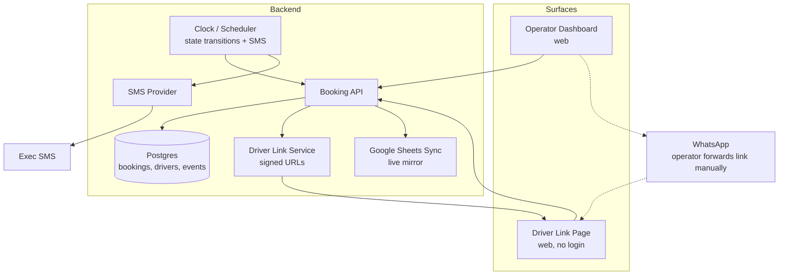
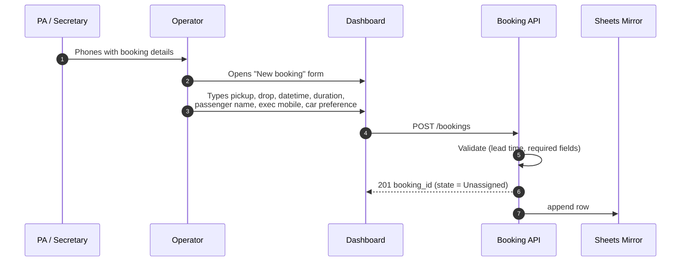
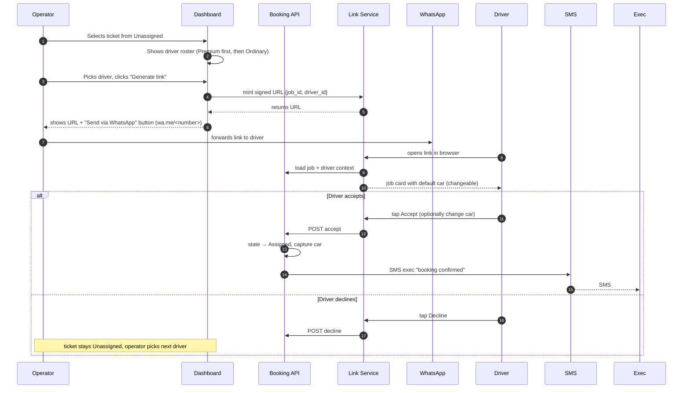
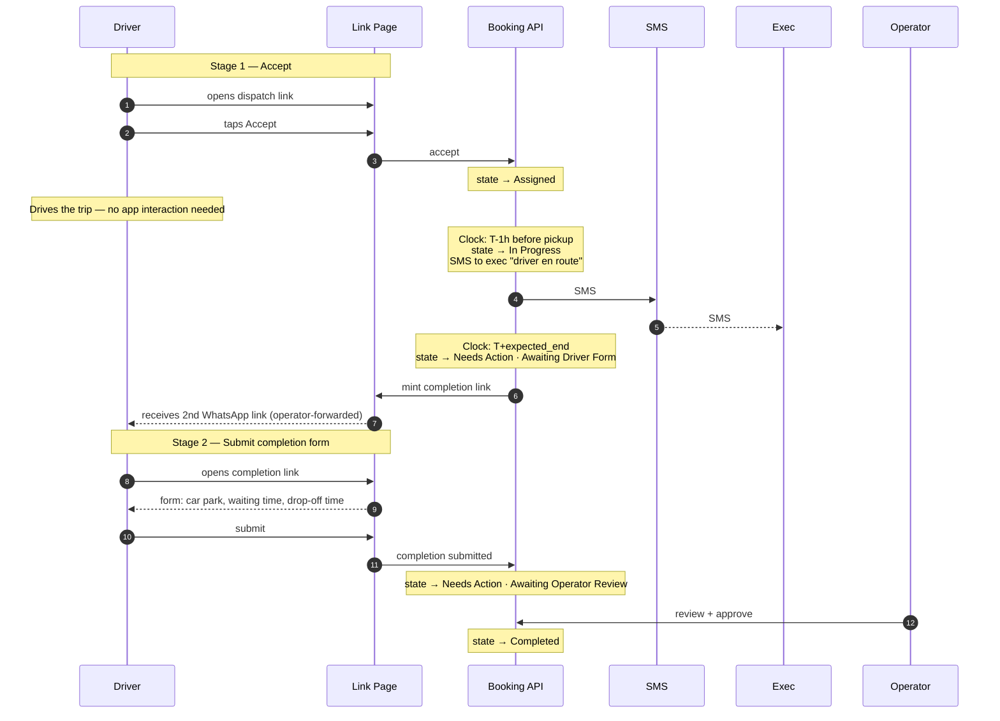
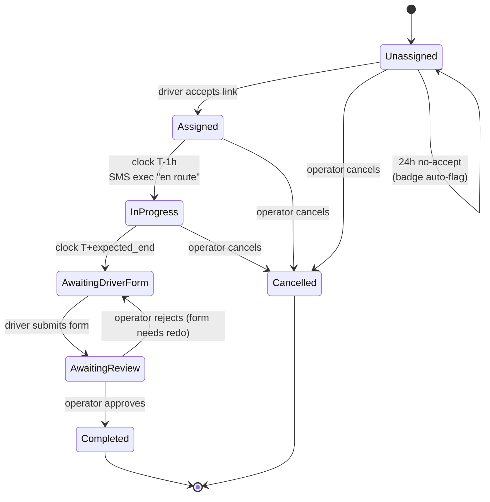

# Chauffeur Dispatch Platform — Design Document

**Status:** Draft for partner review.
**Audience:** Business partner, then the client.
**Purpose:** Capture the design of the MVP — what changes, what stays, why — so we can get partner sign-off before any code is written.

---

## Table of contents

1. [Context](#1-context)
2. [Goals & non-goals](#2-goals--non-goals)
3. [Personas](#3-personas)
4. [System architecture](#4-system-architecture)
5. [Booking flow](#5-booking-flow)
6. [Dispatch flow](#6-dispatch-flow)
7. [Driver flow](#7-driver-flow)
8. [Ticket state machine](#8-ticket-state-machine)
9. [Driver roster & identity-bearing links](#9-driver-roster--identity-bearing-links)
10. [Backup system — Google Sheets live mirror](#10-backup-system--google-sheets-live-mirror)
11. [Notifications](#11-notifications)
12. [Scale considerations](#12-scale-considerations)
13. [Risks & mitigations](#13-risks--mitigations)
14. [Open questions](#14-open-questions)
15. [Next steps](#15-next-steps)

---

## 1. Context

The client runs a chauffeur company turning over approximately **£70k/week** under an exclusivity partnership with a major consultancy. The current operating model:

1. A secretary or PA at the consultancy phones the chauffeur company's office.
2. An operator picks up, captures the booking details (pickup, drop-off, time, passenger name, exec contact) into a shared **spreadsheet**.
3. The operator manually contacts employee drivers — Premium first, then Ordinary — via phone or WhatsApp until one accepts.
4. The operator types the assigned driver's name, type and car into the spreadsheet, then sends a confirmation message to the executive and PA.
5. If no employee driver accepts, the operator falls back to a **WhatsApp group of subcontractor backfill drivers** — first-to-reply wins.
6. At month-end, invoices are calculated from the spreadsheet manually.

The client's words: *"the system works but we can't scale the business any more."*

The bottleneck is the operator. Every booking goes through human hands, the spreadsheet has no live status, and the WhatsApp group is unstructured. The client has explicitly asked that the **client-facing experience does not change** at MVP — PAs keep calling on the phone, execs keep getting the same kind of confirmation message — and that the **modernisation is internal**.

This MVP is sized accordingly: it gives operators a real workplace and structures driver hand-off, without touching the PA or executive experience and without trying to remove operators from the loop.

## 2. Goals & non-goals

### Goals

1. **Replace the spreadsheet** with a live ticket dashboard so operators can see every job, its state, and any issues at a glance.
2. **Replace ad-hoc phone/WhatsApp dispatch** with structured signed links sent to a chosen driver. Operator stays in control of *who* gets offered the job; the system handles state, audit, and notifications.
3. **Automate the executive notifications** that operators currently send manually — without changing how the executive perceives them.
4. **Maintain a live spreadsheet backup** so the business can keep running if our dashboard ever goes down.
5. **Build a foundation** that can extend later to auto-dispatch, billing, recurring bookings, and multi-client tenancy.

### Non-goals (MVP)

- **No secretary portal.** PAs phone the operator exactly as today.
- **No native driver app, no GPS, no live tracking link.** Drivers receive a WhatsApp link, open it in their browser, tap accept/decline. The exec gets the same two messages they get today (assignment + en route), just sent automatically.
- **No auto-cascade dispatch.** The operator chooses which driver to offer a job to.
- **No backfill subcontractor workflow.** Subcontractors continue to use the existing WhatsApp group. The client has confirmed this is rare and not a priority.
- **No automated billing or payment processing.** Month-end invoicing stays manual.
- **No recurring bookings, no multi-leg trips, no multi-tenant.** Hours-based blocks (*"driver for 6 hours"*) are a duration field on a single booking.
- **No per-executive record.** Exec contact details are captured as fields on each booking.

## 3. Personas

| Persona | Channel | What changes for them |
|---|---|---|
| **PA / secretary** at the consultancy | Phone (to the operator) | Nothing. Same call, same questions, same confirmation message. |
| **Executive** (passenger) | SMS | Nothing visible. Same two messages, but sent by the system instead of typed by an operator. |
| **Operator** | Web dashboard | Big change. Replaces the spreadsheet, the phone-down-the-driver-list, and the WhatsApp scramble. Four operators today, each gets a login. |
| **Employee driver** (Premium / Ordinary) | WhatsApp link | New. Receives a link from the operator. Taps accept/decline in the browser. After the trip, taps a second link to submit completion details. No app, no signup. |
| **Subcontractor backfill driver** | Out of MVP | No change. Continues to use the existing WhatsApp group. |

## 4. System architecture

### Components

- **Operator Dashboard (web).** The operator's only workplace. Ticket board (six columns), booking form, driver roster, audit history. Login per operator.
- **Booking API.** Owns CRUD for bookings, drivers, audit events. All writes route through it.
- **Driver Link Service.** Mints signed, expiring URLs that embed `{job_id, driver_id}`. Two link types: **accept/decline** and **completion form**.
- **Driver Link Page (web, no login).** What the driver opens. Same hostname for both link types; the URL token disambiguates.
- **Clock / Scheduler.** A simple in-process job that polls every minute. Drives the timed transitions: `Assigned → In Progress` at T-1h, `In Progress → Needs Action · Awaiting Driver Form` at T+expected_end. Fires exec SMS on the relevant transitions. Fires the 24h no-accept auto-flag.
- **SMS Provider.** Twilio or equivalent. Two outbound templates: "booking confirmed" and "driver en route".
- **Postgres.** Bookings, drivers, audit events. One database, one backend service.
- **Google Sheets Sync.** Continuous mirror of the bookings table into a Google Sheet whose layout matches the current `JJ DATA` workbook (columns A–AD). Every state change writes through.

### Why this shape

- At 50–100 bookings/day, this is small data. Single Postgres, single service.
- No queue broker needed — the Clock is a Postgres-backed polling loop.
- The Driver Link Service is a thin service-within-the-service, conceptually separate because its surface is public (no auth) and its concerns are different from the authenticated dashboard API.
- Google Sheets is the backup precisely because it lives outside our system; if our dashboard breaks, the sheet keeps being openable.

## 5. Booking flow

**Key points:**

- The PA experience is identical to today — they phone the operator, the operator asks the same questions.
- Exec mobile number is **mandatory** at booking time so the system can SMS them later.
- Booking lands in the **Unassigned** column on the dashboard, ready to be dispatched.

## 6. Dispatch flow

**Key points:**

- **Operator-chosen, sequential.** The operator picks one driver. If declined or ignored, the operator picks the next. No auto-cascade.
- **One-tap WhatsApp send.** The dashboard renders a `wa.me/<phone>?text=<prefilled>` link so the operator doesn't need to copy/paste.
- **Default car comes from the roster.** Driver can change for this job only — for example, S-Class default but using EX today. Roster default is not touched.
- **24-hour auto-flag.** If no driver accepts within the configurable window (default 24h, since bookings are placed ≥24h ahead), the ticket gets a flag badge in the Unassigned column so it doesn't get forgotten.

## 7. Driver flow

**Key points:**

- Driver interacts **twice only** — accept the job, fill the completion form. Everything in between is clock-driven.
- **No app install, no login.** Both interactions are a web link from WhatsApp.
- **Identity is in the link** (see §9). No data entry by the driver on first-use.

## 8. Ticket state machine

The board shows **seven columns**: Unassigned · Assigned · In Progress · Needs Action — Awaiting Driver Form · Needs Action — Awaiting Operator Review · Completed · Cancelled.

Operators can filter Completed and Cancelled out of the default view; the live work is the first five columns.

## 9. Driver roster & identity-bearing links

The dashboard maintains a **driver roster** of employee drivers. Fields:

| Field | Notes |
|---|---|
| Name | As it appears on the spreadsheet today |
| Tier | Premium or Ordinary |
| Default car | EX / S Class / MPV / Mini Bus (matches existing spreadsheet reference list) |
| WhatsApp number | Editable when it changes |
| Active | Drivers temporarily off-rota are inactive, not deleted |

Any operator can add, edit, or deactivate a driver. New drivers can be added in ~20 seconds before sending their first link.

### Signed links

The dispatch link looks like `chauffeur.app/j/<token>` where `<token>` is a signed JWT encoding `{job_id, driver_id, link_type, expires_at}`. When the driver opens the link, the system already knows:

- Which job this is
- Which driver this is meant for
- What their default car is

There is **no login**. There is **no signup**. The first time a driver ever clicks a link from the system, they see a job card and tap accept.

### Link forwarding

A risk of identity-in-the-link is that driver A could forward the link to driver B, and the system would record "A accepted" while B is actually driving. Mitigations:

1. The accept page shows *"Job offer for **<driver name>**. Accept?"* at the top — a social check that costs us nothing.
2. The completion form is also identity-bound — the same name is on it. Forwarding the second link is even less plausible.
3. Audit log records every link-open and every state change. Disputes are reconstructable.

We have not designed this for hostile environments — these are employee drivers with an ongoing working relationship.

## 10. Backup system — Google Sheets live mirror

The user has explicitly required that, if the dashboard ever goes down, the business can keep running. **Export-on-demand is insufficient** — if the system is down, there's nothing to export from.

The backup is a **continuous live mirror** to a **Google Sheet** in the client's Google Workspace tenancy:

- Every booking creation, state change, driver assignment, and completion-form submission writes a row update via the Sheets API.
- The sheet's column layout replicates the current `JJ DATA` workbook (columns A–AD: Job#, Date, Pick Up Time, Case Code, Booked By, Passenger Name, Address From, Address To, Customer Account, Car Type, Contract Price, Driver Name, Driver Type, Car Park, Waiting Time, Drop-Off Time, etc.).
- Operators can open the sheet any time the dashboard is unavailable — Sheets is independent of our infrastructure.

The Sheet is the **rollback safety net**. It is not the system of record (the database is), but it is **always a faithful copy**, and operators can fall back to the existing workflow at any moment.

Sync is **write-through**, not periodic — the sheet is up-to-date within seconds of every dashboard action. Sheets API rate limits are well below our write volume at 50–100 bookings/day.

## 11. Notifications

| Event | PA / Secretary | Executive | Driver | Operator |
|---|---|---|---|---|
| Booking created | (heard on the call) | — | — | Ticket appears on board |
| Driver accepts → **Assigned** | (operator confirms verbally end of call, optional) | **SMS** "booking confirmed, driver X, car Y" | (already in-app via link) | Board updates |
| Clock → **In Progress** (T-1h) | — | **SMS** "your driver is en route" | — | Board updates |
| Clock → **Awaiting Driver Form** | — | — | New WhatsApp link from operator | Board updates |
| Driver submits → **Awaiting Review** | — | — | — | Board flag |
| Operator approves → **Completed** | — | — | — | Board updates |
| Cancelled | — | (optional, if assigned) | (optional, if assigned) | Board updates |

Only **two automatic outbound SMS** to the exec, matching exactly what they receive today (just sent by the system rather than typed by an operator).

## 12. Scale considerations

**This MVP does not remove operators from the dispatch loop.** It removes the spreadsheet, the phone-down-the-list, and the WhatsApp scramble — but the operator still chooses which driver to offer each job to. **Operator effort scales with bookings.**

This is a deliberate choice for v1: the client wants the human in the loop, and we want to ship a system the operators trust before automating their judgement away.

At 50–100 bookings/day across 4 operators, that's 12–25 bookings per operator per day. Each booking is now a few clicks (open ticket → pick driver → send link) rather than several phone calls. That should comfortably absorb growth to ~150/day with the same headcount.

### What's a v2 lever, not an MVP one

| Capability | Why deferred |
|---|---|
| Auto-cascade (system offers to top N drivers automatically) | Want operators to trust the link flow first |
| Scored shortlist (proximity, recent acceptance rate, hours worked) | Need real data to weight |
| Auto-billing from completed tickets | Whole separate workstream |
| Secretary portal (PA self-serve) | Client explicitly asked: no change for PAs |
| Live exec tracking link | Requires GPS; out of scope without a driver app |

### Architectural headroom

The single-Postgres single-service shape supports 10× the MVP volume with no rewrite. The dispatch logic is the only piece that scales linearly with operator effort, and that's the v2 work.

## 13. Risks & mitigations

| Risk | Likelihood | Impact | Mitigation |
|---|---|---|---|
| Operators don't trust the new dashboard | Medium | High | Sheets mirror stays live throughout MVP; operators can fall back any time. Pilot with one operator before all four cut over. |
| Drivers don't tap "decline" — they just ignore | High | Medium | 24h auto-flag is the safety net; operator can offer to another driver at any time without explicit decline. |
| Driver forwards link to another driver | Low | Low | Name on accept page; audit log; ongoing employment relationship. |
| Driver's WhatsApp number changes | Medium | Low | Operator updates the roster from the dashboard in seconds. |
| Driver doesn't fill the completion form | Medium | Medium | Ticket sits in "Awaiting Driver Form" — visible on board; operator chases. |
| Sheets API hiccup causes drift between DB and mirror | Low | Medium | Mirror writes are logged; a one-shot resync job rebuilds the sheet from the DB. |
| SMS provider downtime means execs don't get notifications | Low | Medium | Provider has SLAs; operator can fall back to manual SMS. |
| Client adds billing or PA portal to scope late | Medium | High | Documented as out-of-scope here; defended in writing before build. |

## 14. Open questions

Full list with rationale: see [`OPEN-QUESTIONS.md`](./OPEN-QUESTIONS.md). They do not block partner sign-off; they shape the build.

## 15. Next steps

1. **Partner reviews** this document and [`EXECUTIVE-SUMMARY.md`](./EXECUTIVE-SUMMARY.md).
2. **Partner signs off** on scope — particularly the explicit non-goals in §2.
3. **Partner takes [`OPEN-QUESTIONS.md`](./OPEN-QUESTIONS.md) to the client** to close remaining unknowns.
4. **Build-phase planning** then produces: data model (ERD + table specs), REST API contract, dashboard UI mockups, and a build estimate.
5. **Build.**
