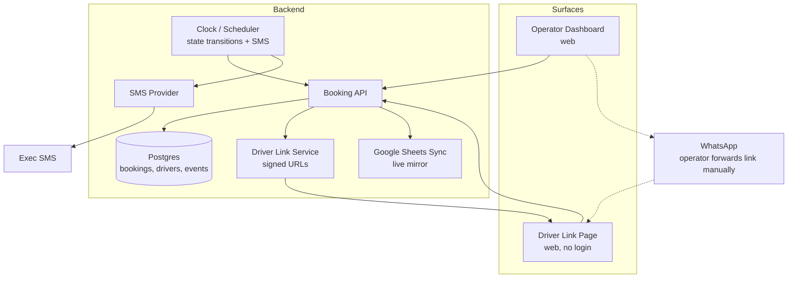

# System architecture

```mermaid
graph TB
  subgraph Surfaces
    DASH[Operator Dashboard<br/>web]
    DLINK[Driver Link Page<br/>web, no login]
  end

  subgraph Backend
    API[Booking API]
    LINKS[Driver Link Service<br/>signed URLs]
    CLOCK[Clock / Scheduler<br/>state transitions + SMS]
    NOTIF[SMS Provider]
    DB[(Postgres<br/>bookings, drivers, events)]
    SHEETS[Google Sheets Sync<br/>live mirror]
  end

  WA[WhatsApp<br/>operator forwards link manually]
  EXEC[Exec SMS]

  DASH --> API
  API --> DB
  API --> LINKS
  LINKS --> DLINK
  DLINK --> API
  API --> SHEETS
  CLOCK --> API
  CLOCK --> NOTIF
  NOTIF --> EXEC
  DASH -.-> WA
  WA -.-> DLINK
```
