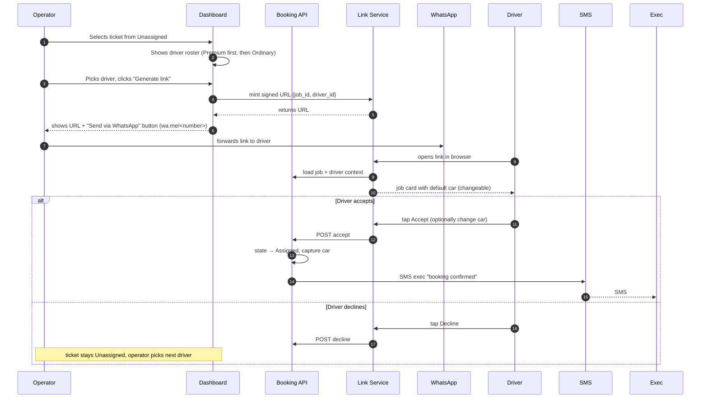

# Dispatch flow

```mermaid
sequenceDiagram
  autonumber
  participant O as Operator
  participant D as Dashboard
  participant API as Booking API
  participant L as Link Service
  participant W as WhatsApp
  participant Dr as Driver
  participant N as SMS
  participant E as Exec

  O->>D: Selects ticket from Unassigned
  D->>D: Shows driver roster (Premium first, then Ordinary)
  O->>D: Picks driver, clicks "Generate link"
  D->>L: mint signed URL {job_id, driver_id}
  L-->>D: returns URL
  D-->>O: shows URL + "Send via WhatsApp" button (wa.me/<number>)
  O->>W: forwards link to driver

  Dr->>L: opens link in browser
  L->>API: load job + driver context
  L-->>Dr: job card with default car (changeable)

  alt Driver accepts
    Dr->>L: tap Accept (optionally change car)
    L->>API: POST accept
    API->>API: state → Assigned, capture car
    API->>N: SMS exec "booking confirmed"
    N-->>E: SMS
  else Driver declines
    Dr->>L: tap Decline
    L->>API: POST decline
    Note over O,D: ticket stays Unassigned, operator picks next driver
  end
```
