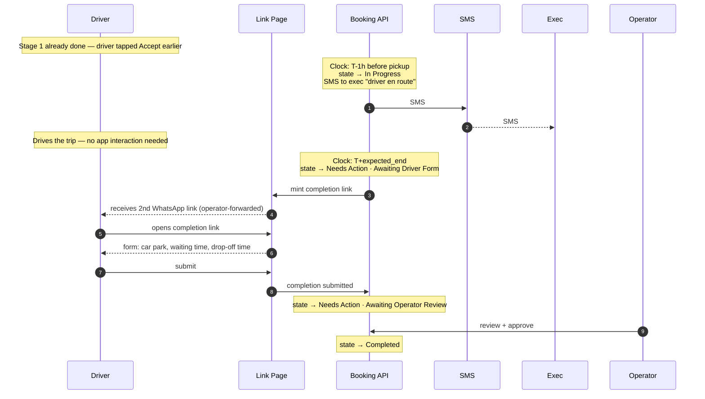

# Trip flow — clock-driven transitions

```mermaid
sequenceDiagram
  autonumber
  participant Dr as Driver
  participant L as Link Page
  participant API as Booking API
  participant N as SMS
  participant E as Exec
  participant O as Operator

  Note over Dr: Stage 1 already done — driver tapped Accept earlier

  Note over API: Clock: T-1h before pickup<br/>state → In Progress<br/>SMS to exec "driver en route"
  API->>N: SMS
  N-->>E: SMS

  Note over Dr: Drives the trip — no app interaction needed

  Note over API: Clock: T+expected_end<br/>state → Needs Action · Awaiting Driver Form
  API->>L: mint completion link
  L-->>Dr: receives 2nd WhatsApp link (operator-forwarded)

  Dr->>L: opens completion link
  L-->>Dr: form: car park, waiting time, drop-off time
  Dr->>L: submit
  L->>API: completion submitted
  Note over API: state → Needs Action · Awaiting Operator Review

  O->>API: review + approve
  Note over API: state → Completed
```
