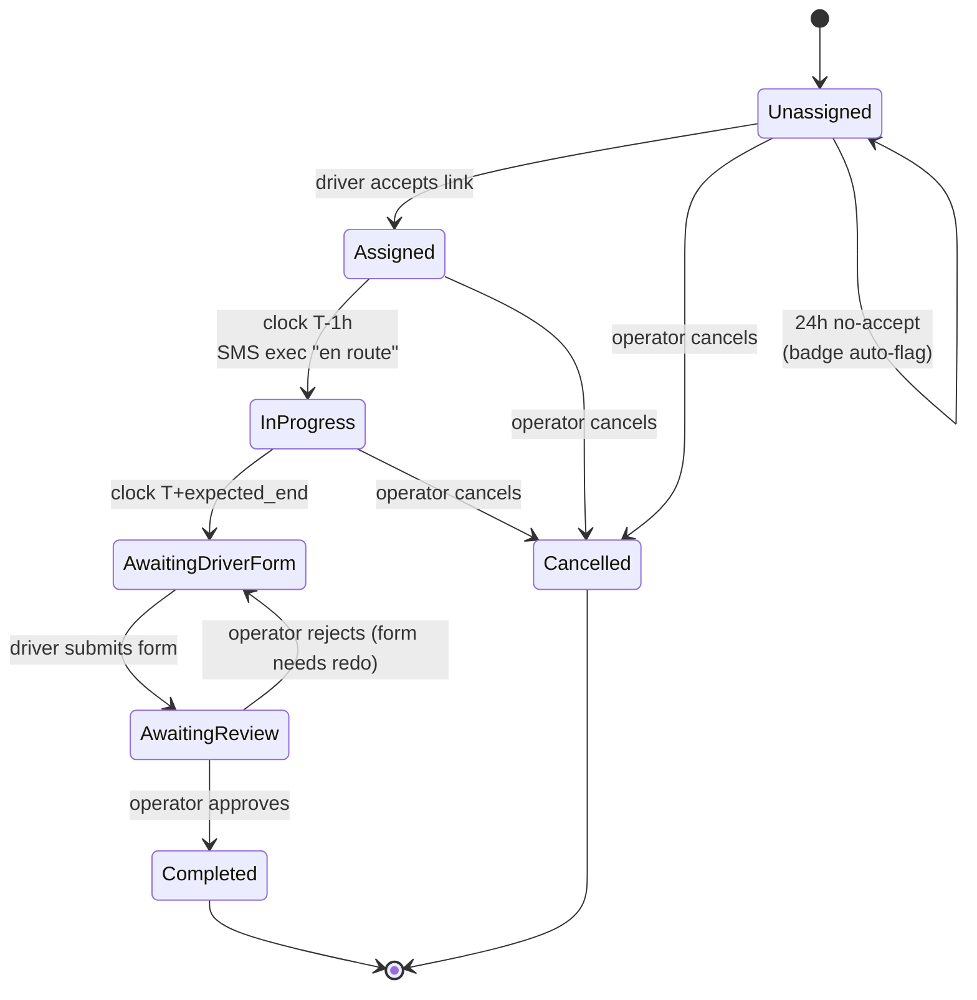

# Ticket state machine

```mermaid
stateDiagram-v2
  [*] --> Unassigned
  Unassigned --> Assigned: driver accepts link
  Unassigned --> Cancelled: operator cancels
  Unassigned --> Unassigned: 24h no-accept<br/>(badge auto-flag)

  Assigned --> InProgress: clock T-1h<br/>SMS exec "en route"
  Assigned --> Cancelled: operator cancels

  InProgress --> AwaitingDriverForm: clock T+expected_end
  InProgress --> Cancelled: operator cancels

  AwaitingDriverForm --> AwaitingReview: driver submits form
  AwaitingReview --> Completed: operator approves
  AwaitingReview --> AwaitingDriverForm: operator rejects (form needs redo)
  Completed --> [*]
  Cancelled --> [*]
```

**Seven board columns:** Unassigned · Assigned · In Progress · Awaiting Driver Form · Awaiting Operator Review · Completed · Cancelled.
