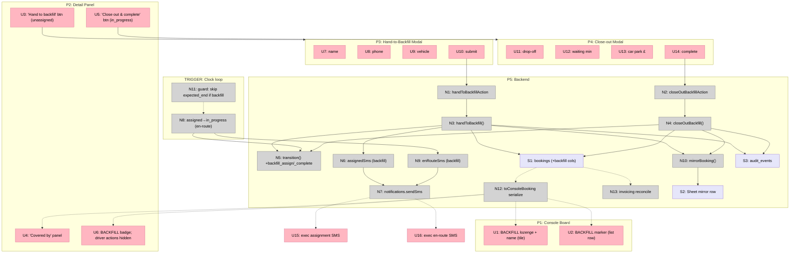

# Backfill Drivers — Breadboard & Slices

> Shape: [`shaping.md`](./shaping.md) Shape B. This is the **Detail B** breadboard
> (affordance tables = source of truth) and the vertical slices.

## Places

| # | Place | Status | Where |
|---|-------|--------|-------|
| P1 | Console Board (board + list) | existing — modified | `components/console/console-board.tsx` |
| P2 | Booking Detail Panel | existing — modified | `components/console/detail-panel.tsx` |
| P3 | Hand-to-Backfill Modal | **NEW** | `components/console/backfill-modal.tsx` |
| P4 | Close-out Completion Modal | **NEW** | `components/console/backfill-closeout-modal.tsx` |
| P5 | Backend (services / domain / db) | existing + new | `server/*` |
| TRIGGER | Clock loop | existing — guarded | `server/services/clock-tick.ts` |

## UI Affordances

| # | Place | Component | Affordance | Control | Wires Out | Returns To |
|---|-------|-----------|------------|---------|-----------|------------|
| U1 | P1 | BoardCard | `BACKFILL` lozenge + backfill name on the tile | render | — | ← N12 |
| U2 | P1 | list row | `BACKFILL` marker in the driver cell | render | — | ← N12 |
| U3 | P2 | detail-panel (`unassigned`) | **"Hand to backfill"** button (beside "Find a driver") | click | → P3 | — |
| U4 | P2 | detail-panel | **"Covered by"** panel (name / phone / car) when `isBackfill` | render | — | ← N12 |
| U5 | P2 | detail-panel (`in_progress` + `isBackfill`) | **"Close out & complete"** button | click | → P4 | — |
| U6 | P2 | detail-panel hero | `BACKFILL` badge; driver-only actions hidden when `isBackfill` | render | — | ← N12 |
| U7 | P3 | backfill-modal | name input | type | → N1 | — |
| U8 | P3 | backfill-modal | phone input | type | → N1 | — |
| U9 | P3 | backfill-modal | vehicle input | type | → N1 | — |
| U10 | P3 | backfill-modal | "Hand to backfill" submit | click | → N1 | — |
| U11 | P4 | closeout-modal | drop-off time input | type | → N2 | — |
| U12 | P4 | closeout-modal | waiting minutes input | type | → N2 | — |
| U13 | P4 | closeout-modal | car park £ input | type | → N2 | — |
| U14 | P4 | closeout-modal | "Complete booking" submit | click | → N2 | — |
| U15 | (exec phone) | notification | **assignment SMS** (names backfill driver/car) | render | — | ← N6 |
| U16 | (exec phone) | notification | **en-route SMS** | render | — | ← N9 |

## Code Affordances

| # | Place | Component | Affordance | Control | Wires Out | Returns To |
|---|-------|-----------|------------|---------|-----------|------------|
| N1 | P3 | console-actions | `handToBackfillAction(bookingId, {name,phone,car})` | call | → N3 | — |
| N2 | P4 | console-actions | `closeOutBackfillAction(bookingId, {dropoffAt,waitingTimeMinutes,carParkPence})` | call | → N4 | — |
| N3 | P5 | services/backfill | `handToBackfill()` — load, transition, write fields + `state=assigned`, audit, exec msg, mirror | call | → N5, → S1, → N6, → N10, → S3 | → N1 |
| N4 | P5 | services/backfill | `closeOutBackfill()` — load, transition, write completion fields + `state=completed`, audit, mirror | call | → N5, → S1, → N10, → S3 | → N2 |
| N5 | P5 | domain/booking-state | `transition()` + **NEW** events `backfill_assign` (`unassigned→assigned`, side effect `notify_exec_assigned`) and `backfill_complete` (`in_progress→completed`) | call | — | → N3, N4 |
| N6 | P5 | services/sms-templates | `assignedSms()` — **adapt** to take backfill name/car (no `Driver` row) | call | → N7 | → U15 |
| N7 | P5 | adapters/notifications | `notifications.sendSms()` | call | — | → U15, U16 |
| N8 | TRIGGER | services/clock-tick | `assigned → in_progress` (`clock_pickup_minus_1h`) — fires for backfill too | call | → N5, → N9 | — |
| N9 | P5 | services/sms-templates | `enRouteSms()` — **adapt** for backfill name | call | → N7 | → U16 |
| N10 | P5 | services/mirror | `mirrorBooking()` — Sheets row incl. backfill name + flag | call | → S2 | — |
| N11 | TRIGGER | services/clock-tick | **guard**: skip `clock_expected_end` when `isBackfill` (stays `in_progress`; no completion link) | conditional | — | — |
| N12 | P1/P2 | page.tsx `toConsoleBooking` + `ConsoleBooking` type | serialize `isBackfill` + backfill fields to the client | call | — | → U1, U2, U4, U6 |
| N13 | P5 | invoicing (`reconcile` / billable query) | completed backfill jobs included; `isBackfill` available for reporting | read | → S1 | — |

## Data Stores

| # | Place | Store | Description |
|---|-------|-------|-------------|
| S1 | P5 | `bookings` (+ new cols) | `is_backfill` bool, `backfill_driver_name`, `backfill_driver_phone`, `backfill_car`. Reuses existing `carForThisJob`, `dropoffAt`, `waitingTimeMinutes`, `carParkPence`. |
| S2 | P5 | Google Sheet mirror row | The JJ mirror row for the booking (backfill name shown in the driver column). |
| S3 | P5 | `audit_events` | New actions `hand_to_backfill`, `backfill_completed`. |

## Breadboard

## Slices

Three vertical slices, one per lifecycle stage — each demo-able through the simulator + console.

| # | Slice | Parts | Affordances | Demo |
|---|-------|-------|-------------|------|
| **V1** | **Hand to backfill → Assigned + marked** | B1, B2, B5 | S1, U3, P3 (U7–U10), N1, N3, N5(`backfill_assign`), N6, N7, U15, N10, S2, S3, N12, U1, U2, U4, U6 | From an `unassigned` booking, click **"Hand to backfill"**, enter Dave Smith / phone / car → booking moves to **Assigned** showing a `BACKFILL` lozenge + Dave's name on the **tile, list row, and detail panel** ("covered by"); the exec gets the **assignment SMS**. Driver-only actions are hidden. |
| **V2** | **Clock-driven en-route (+ guard)** | B3 | N8, N5 (reuse), N9, N7, U16, N11 | Fast-forward the clock past pickup → backfill booking → **In progress** + exec **en-route SMS**. Fast-forward past expected end → it **stays In progress** (no `awaiting_driver_form`, no completion link). |
| **V3** | **Operator close-out → Completed (+ invoicing)** | B4 | U5, P4 (U11–U14), N2, N4, N5(`backfill_complete`), N10, S2, S3, N13 | From the in-progress backfill booking, click **"Close out & complete"**, enter drop-off / waiting / car park (same fields as the driver form) → **Completed**; the job appears in **invoicing** flagged as backfill. |

**Lifecycle e2e:** V1–V3 together drive one backfill booking `unassigned → assigned → in_progress → completed` via the simulator — extend `tests/e2e/lifecycle.spec.ts` with a backfill arm (per CLAUDE.md's coverage rule for new transitions + console actions).

**Notes on wires to future slices:** V1 sets `isBackfill`; the clock guard (N11, V2) and close-out (N4, V3) depend on it but are no-ops until built.
