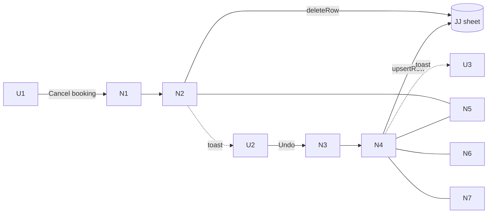

# Booking Revoke — Slices

> Shape F from [`shaping.md`](./shaping.md). One vertical slice — shipped as
> `feat/undo-cancel`. ADR: `docs/adr/0011-cancel-undo-window.md`.

## V1: One-click cancel + 60 s undo (F1–F5) — BUILT

**Demo:** open a booking → Cancel → "Cancel this booking?" → Cancel booking →
toast "Booking cancelled. [Undo]" → Undo → "Cancellation undone." and the
booking is back in its previous column and back in the sheet. Cancel again →
final. (Integration test covers the refused undo after 60 s via `fixedClock`.)

### UI affordances

| ID | Affordance | Place | Wires out |
|----|-----------|-------|-----------|
| U1 | Cancel confirm modal — title, passenger/time/Job #, note, **Keep booking** / **Cancel booking** | `cancel-modal.tsx` | → N1 |
| U2 | Toast "Booking cancelled." with **Undo** button, lives `UNDO_CANCEL_WINDOW_MS` | `console-board.tsx` | → N3 |
| U3 | Toast "Cancellation undone." / "Too late — the cancellation is final." | `console-board.tsx` | — |

### Non-UI affordances

| ID | Affordance | Place | Wires out |
|----|-----------|-------|-----------|
| N1 | `cancelBookingAction(bookingId, reason?)` | `console-actions.ts` | → N2 |
| N2 | `cancelBooking` — reason optional; sets `state_before_cancel`; lapses offers; deletes sheet row | `services/cancel.ts` | → sheet `deleteRow` |
| N3 | `undoCancelAction(bookingId)` | `console-actions.ts` | → N4 |
| N4 | `undoCancel` — guards `cancelled` + window (`canUndoCancel`) + prior state; `undo_cancel` transition; clears cancel fields; audit `undo_cancel`; re-upserts sheet row | `services/undo-cancel.ts` | → sheet `upsertRow` |
| N5 | `bookings.state_before_cancel` (migration 0030, additive) | `db/schema.ts` | — |
| N6 | `undo_cancel` event: `cancelled → to` | `domain/booking-state.ts` | — |
| N7 | `UNDO_CANCEL_WINDOW_MS` (lib) + `canUndoCancel` (domain) | `lib/undo-window.ts`, `domain/undo-window.ts` | — |

### Wiring

### Tests

| Layer | File | Covers |
|-------|------|--------|
| Unit | `tests/unit/domain/booking-state.test.ts` | `undo_cancel` to each cancellable state; refused from non-cancelled; `cancelled` still terminal |
| Unit | `tests/unit/domain/undo-window.test.ts` | window boundaries, no timestamp, clock skew |
| Integration | `tests/integration/services/cancel.test.ts` | reason optional / blank; `state_before_cancel` recorded; max length |
| Integration | `tests/integration/services/undo-cancel.test.ts` | restore unassigned/assigned; sheet row back; audit; too late; not cancelled; not found; legacy no prior state; idempotent |
| E2E | `tests/e2e/lifecycle.spec.ts` | cancel → Undo → prior state; cancel → final |
