# Exec Messaging — Channels — Slices

> Implementation plan for Shape A in [`shaping.md`](./shaping.md). The shaping doc is ground
> truth for R's, parts, and the fit check. This doc is ground truth for the breadboard
> (affordances + wiring) and the vertical slices. If a slice reveals a new mechanism, ripple
> it up into `shaping.md`.

Three slices, each demo-able on its own:

- **V1 — Persistence + visibility on SMS.** Build the shared layer (table, wrapper, cached column, tile/panel/drawer/resend) while the channel constant stays `sms`. Ships value immediately and de-risks everything email rides on.
- **V2 — Email channel + switch.** `EmailPort` + Resend/Fake adapters, email templates, `exec_email` field + channel-aware form, flip-by-constant. Email sends are accepted-only (`pending`) until V3.
- **V3 — Delivery webhooks.** `/api/webhooks/resend` turns "accepted" into true `delivered`/`bounced`/`complained`, resolving `pending` and lighting the board on a bounce.

---

## Places

| # | Place | Description | Status |
|---|-------|-------------|--------|
| P1 | Booking Board (dashboard) | Tiles for all bookings | existing — modified |
| P2 | Booking Detail Panel | Per-booking detail; gains exec-message health indicator | existing — modified |
| P2.1 | Exec Messages Drawer | Subplace of P2: full per-booking message timeline + resend | new |
| P3 | New/Edit Booking Modal | Booking form; gains `exec_email` field + channel-aware validation | existing — modified |
| P4 | Backend | Services, wrapper, adapters, DB tables; the two existing exec send sites | existing — modified |
| P5 | Resend Webhook | `POST /api/webhooks/resend` — verifies + applies delivery events | new |

Three existing **triggers** live in P4 and kick off the send flow: `dispatch.ts` driver-accept and `backfill.ts` hand-to-backfill (both `assigned`), and `clock-tick.ts` en-route (`en_route`). N9 below stands for both `assigned` sites — `backfill.ts` is wrapped identically to `dispatch.ts`.

---

## UI Affordances

| # | Place | Component | Affordance | Control | Wires Out | Returns To | Slice |
|---|-------|-----------|------------|---------|-----------|------------|:----:|
| U1 | P1 | booking-tile | booking tile | render | — | — | existing |
| U2 | P1 | booking-tile | exec-failure indicator (red dot/lozenge) | render | — | — | V1 |
| U3 | P2 | detail-panel | exec health indicator (✓ ok / ⏳ pending / ⚠ failed+count) | click | → P2.1 | — | V1 |
| U4 | P2.1 | exec-messages-drawer | message list | render | — | — | V1 |
| U5 | P2.1 | exec-messages-drawer | message row (channel icon · kind · status · time) | render | — | — | V1 |
| U6 | P2.1 | exec-messages-drawer | error reason (on failed/bounced) | render | — | — | V1 |
| U7 | P2.1 | exec-messages-drawer | Resend button (on failed/bounced) | click | → N12 | — | V1 |
| U8 | P3 | booking-form | exec mobile input | type | → form state | — | existing |
| U9 | P3 | booking-form | exec email input | type | → form state | — | V2 |
| U10 | P3 | booking-form | Save booking button | click | → N15 | — | existing — modified |

---

## Code Affordances

| # | Place | Component | Affordance | Control | Wires Out | Returns To | Slice |
|---|-------|-----------|------------|---------|-----------|------------|:----:|
| N1 | P4 | config | `EXEC_NOTIFICATION_CHANNEL` constant (`'sms'`\|`'email'`) | config | — | → N2 | V1 |
| N2 | P4 | exec-notifications | `sendExecNotification()` wrapper | call | → N21, → N7/N8, → N3/N4, → N5, → N6 | — | V1 (sms) / V2 (email) |
| N3 | P4 | notification-twilio / -fake | `NotificationPort.sendSms()` | call | — | → N2 | existing |
| N4 | P4 | email-resend / -fake | `EmailPort.sendEmail()` | call | — | → N2 | V2 |
| N5 | P4 | exec-notifications | `recordExecNotification()` (insert row) | write | → S1 | — | V1 |
| N6 | P4 | exec-notifications | `updateBookingExecStatus()` (cached col) | write | → S2 | — | V1 |
| N7 | P4 | sms-templates | `assignedSms` / `enRouteSms` | call | — | → N3 | existing |
| N8 | P4 | email-templates | `assignedEmail` / `enRouteEmail` ({subject,text}) | call | — | → N4 | V2 |
| N9 | P4 | dispatch + backfill | `assigned` sites → wrapper (driver-accept + hand-to-backfill) | call | → N2 | — | V1 (replace) |
| N10 | P4 | clock-tick | en-route site → wrapper | call | → N2 | — | V1 (replace) |
| N11 | P2.1 | console-actions | query `exec_notifications` by booking | call | — | → U4, U5, U6 | V1 |
| N12 | P2.1 | console-actions | `resendExecNotification(id)` | call | → N2, → N13 | — | V1 |
| N13 | P4 | exec-notifications | mark old row `superseded` | write | → S1 | — | V1 |
| N14 | P1 | bookings-query | board read of cached status | call | — | → U1, U2 | V1 |
| N15 | P3 | booking validation | channel-aware required-contact check | call | → N16 | — | V2 |
| N16 | P4 | bookings service | create/edit booking writes `exec_email` | write | → S3 | — | V2 |
| N17 | P5 | api/webhooks/resend | `POST` route handler | call | → N18 | — | V3 |
| N18 | P5 | webhook-verify | `verifySvixSignature()` (HMAC-SHA256, const-time, 5-min replay) | call | → N19 | — | V3 |
| N19 | P5 | webhook-handler | `handleResendEvent()` map event → status by `provider_message_id` | call | → N20, → N6 | — | V3 |
| N20 | P5 | exec-notifications | update row → `delivered`/`bounced`/`complained` | write | → S1 | — | V3 |
| N21 | P4 | exec-notifications | no-contact guard (missing email/mobile → `failed` row) | call | → N5, → N6 | — | V2 |

---

## Data Stores

| # | Place | Store | Description | Slice |
|---|-------|-------|-------------|:----:|
| S1 | P4 | `exec_notifications` | One row per attempt: channel, kind, to, subject?, body, status, provider_message_id?, error_reason?, ts. Status `sent`/`failed`/`superseded` (V1); email rows start `sent` (V2); `delivered`/`bounced`/`complained` (V3) | V1 |
| S2 | P4 | `bookings.exec_notification_status` | Cached: `none`/`ok`/`failed` (V1); `pending` for accepted-email (V2) | V1 |
| S3 | P4 | `bookings.exec_email` | Nullable, Zod-`email` validated | V2 |
| S4 | Resend (external) | delivery events | `email.delivered`/`bounced`/`complained`/`delivery_delayed`, keyed by `email_id` | V3 |

---

## Full-system breadboard

```mermaid
flowchart TB
    subgraph P1["P1: Booking Board"]
        U1["U1: booking tile"]
        U2["U2: exec-failure indicator"]
        N14["N14: board read cached status"]
    end

    subgraph P2["P2: Detail Panel"]
        U3["U3: exec health indicator"]
        subgraph P2_1["P2.1: Exec Messages Drawer"]
            U4["U4: message list"]
            U5["U5: message row"]
            U6["U6: error reason"]
            U7["U7: Resend button"]
            N11["N11: query exec_notifications"]
            N12["N12: resendExecNotification()"]
        end
    end

    subgraph P3["P3: Booking Form"]
        U8["U8: exec mobile input"]
        U9["U9: exec email input"]
        U10["U10: Save button"]
        N15["N15: channel-aware validation"]
    end

    subgraph P4["P4: Backend"]
        N1["N1: EXEC_NOTIFICATION_CHANNEL"]
        N9["N9: dispatch driver-accept"]
        N10["N10: clock-tick en-route"]
        N2["N2: sendExecNotification()"]
        N21["N21: no-contact guard"]
        N7["N7: sms templates"]
        N8["N8: email templates"]
        N3["N3: sendSms (Twilio/Fake)"]
        N4["N4: sendEmail (Resend/Fake)"]
        N5["N5: recordExecNotification()"]
        N6["N6: updateBookingExecStatus()"]
        N13["N13: mark old row superseded"]
        N16["N16: write exec_email"]
        S1["S1: exec_notifications"]
        S2["S2: exec_notification_status"]
        S3["S3: bookings.exec_email"]
    end

    subgraph P5["P5: Resend Webhook"]
        N17["N17: POST /api/webhooks/resend"]
        N18["N18: verifySvixSignature()"]
        N19["N19: handleResendEvent()"]
        N20["N20: update row status"]
    end

    S4["S4: Resend delivery events"]

    %% send flow
    N9 --> N2
    N10 --> N2
    N1 -.->|channel| N2
    N2 --> N21
    N2 --> N7
    N2 --> N8
    N7 --> N3
    N8 --> N4
    N3 -.-> N2
    N4 -.-> N2
    N2 --> N5
    N2 --> N6
    N21 --> N5
    N21 --> N6
    N5 --> S1
    N6 --> S2

    %% board
    N14 -.-> S2
    N14 -.-> U1
    N14 -.-> U2

    %% panel + drawer
    U3 --> P2_1
    N11 -.-> S1
    N11 -.-> U4
    N11 -.-> U5
    N11 -.-> U6
    U7 --> N12
    N12 --> N2
    N12 --> N13
    N13 --> S1

    %% form
    U8 --> U10
    U9 --> U10
    U10 --> N15
    N15 --> N16
    N16 --> S3

    %% webhook
    S4 --> N17
    N17 --> N18
    N18 --> N19
    N19 --> N20
    N19 --> N6
    N20 --> S1

    classDef ui fill:#ffb6c1,stroke:#d87093,color:#000
    classDef nonui fill:#d3d3d3,stroke:#808080,color:#000
    classDef store fill:#e6e6fa,stroke:#9370db,color:#000
    class U1,U2,U3,U4,U5,U6,U7,U8,U9,U10 ui
    class N1,N2,N3,N4,N5,N6,N7,N8,N9,N10,N11,N12,N13,N14,N15,N16,N17,N18,N19,N20,N21 nonui
    class S1,S2,S3,S4 store
```

---

## Slice summary

| # | Slice | Parts (from shape) | Affordances added | Demo |
|---|-------|--------------------|-------------------|------|
| V1 | Persistence + visibility on SMS | A1 (constant+port, sms), A3, A4, A5, A9, A10 | U2, U3, U4, U5, U6, U7, N1, N2(sms), N5, N6, N9, N10, N11, N12, N13, N14, S1, S2 | Dispatch-accept records a `sent` exec SMS; simulate a Twilio failure → tile turns red + panel ⚠ + drawer shows it; click Resend → new `sent` row, old `superseded`, tile clears |
| V2 | Email channel + switch | A1 (EmailPort), A2, A6, A7, A10 | U9, N2(email), N4, N8, N15, N16, N21, S3 | Flip constant to `email`; create a booking with `exec_email`; dispatch-accept sends an email (Fake/Resend), drawer shows ✉️ `pending`; a booking with no email → loud `failed` row + red tile |
| V3 | Delivery webhooks | A8, A10 | N17, N18, N19, N20, S4 | Send to `delivered@resend.dev` → webhook flips row `delivered` + panel ✓; send to `bounced@resend.dev` → webhook flips row `bounced` + tile red; resend to a good address clears it |

---

## V1 — Persistence + visibility on SMS

**Demo:** "A confirmation SMS to the exec is now recorded. Force a send failure and the booking goes red on the board; open it, see the failed message, hit Resend, watch it clear."

| # | Place | Component | Affordance | Control | Wires Out | Returns To |
|---|-------|-----------|------------|---------|-----------|------------|
| U2 | P1 | booking-tile | exec-failure indicator | render | — | — |
| U3 | P2 | detail-panel | exec health indicator | click | → P2.1 | — |
| U4 | P2.1 | exec-messages-drawer | message list | render | — | — |
| U5 | P2.1 | exec-messages-drawer | message row | render | — | — |
| U6 | P2.1 | exec-messages-drawer | error reason | render | — | — |
| U7 | P2.1 | exec-messages-drawer | Resend button | click | → N12 | — |
| N1 | P4 | config | `EXEC_NOTIFICATION_CHANNEL` (= `'sms'`) | config | — | → N2 |
| N2 | P4 | exec-notifications | `sendExecNotification()` (sms branch) | call | → N7, → N3, → N5, → N6 | — |
| N5 | P4 | exec-notifications | `recordExecNotification()` | write | → S1 | — |
| N6 | P4 | exec-notifications | `updateBookingExecStatus()` | write | → S2 | — |
| N9 | P4 | dispatch | driver-accept → wrapper | call | → N2 | — |
| N10 | P4 | clock-tick | en-route → wrapper | call | → N2 | — |
| N11 | P2.1 | console-actions | query `exec_notifications` | call | — | → U4, U5, U6 |
| N12 | P2.1 | console-actions | `resendExecNotification(id)` | call | → N2, → N13 | — |
| N13 | P4 | exec-notifications | mark old row `superseded` | write | → S1 | — |
| N14 | P1 | bookings-query | board read cached status | call | — | → U1, U2 |
| S1 | P4 | `exec_notifications` | rows (status `sent`/`failed`/`superseded`) | store | — | → N11, N14 |
| S2 | P4 | `bookings.exec_notification_status` | `none`/`ok`/`failed` | store | — | → N14 |

**Tests:** wrapper persists `sent`+status `ok` on success; `ok:false` → `failed`+status `failed`; thrown adapter exception → `failed` (best-effort, send path survives); successful resend supersedes + clears; partial resend leaves `failed` while another row still failed. Lifecycle e2e: forced failure shows tile + resend clears. Uses `FakeNotificationAdapter.simulateFailure`.

---

## V2 — Email channel + switch

**Demo:** "Flip one constant to `email`. New bookings now collect an exec email and the confirmation goes out by email instead of SMS — shown as ✉️ pending in the drawer. Leave the email blank and the booking goes red immediately, never silent."

| # | Place | Component | Affordance | Control | Wires Out | Returns To |
|---|-------|-----------|------------|---------|-----------|------------|
| U9 | P3 | booking-form | exec email input | type | → form state | — |
| N2 | P4 | exec-notifications | `sendExecNotification()` (email branch added) | call | → N21, → N8, → N4, → N5, → N6 | — |
| N4 | P4 | email-resend / -fake | `EmailPort.sendEmail()` | call | — | → N2 |
| N8 | P4 | email-templates | `assignedEmail` / `enRouteEmail` | call | — | → N4 |
| N15 | P3 | booking validation | channel-aware required-contact check | call | → N16 | — |
| N16 | P4 | bookings service | write `exec_email` | write | → S3 | — |
| N21 | P4 | exec-notifications | no-contact guard → `failed` (`no_email`) | call | → N5, → N6 | — |
| S3 | P4 | `bookings.exec_email` | nullable, validated | store | — | → N2 |

Adds `pending` to S2 (email accepted, awaiting delivery confirmation). Board stays binary (pending ≠ failed → no red); `pending` shows only in the panel (U3 ⏳).

**Tests:** `EmailPort` contract test (Fake + Resend request shape) in `tests/contracts/`; wrapper email branch → row `channel='email'`, status `sent`, S2 `pending`; channel constant routes wrapper to the right port; form requires `exec_email` in email mode and `exec_mobile` in sms mode; missing contact → `failed` (`no_email`). No new npm dep — `ResendEmailAdapter` uses `fetch`.

---

## V3 — Delivery webhooks

**Demo:** "Send to `delivered@resend.dev` and the message turns green when Resend calls back. Send to `bounced@resend.dev` and the booking lights up red — the silent failure is now loud. Resend to a good address and it clears."

| # | Place | Component | Affordance | Control | Wires Out | Returns To |
|---|-------|-----------|------------|---------|-----------|------------|
| N17 | P5 | api/webhooks/resend | `POST` route handler | call | → N18 | — |
| N18 | P5 | webhook-verify | `verifySvixSignature()` (HMAC-SHA256, const-time, 5-min replay window) | call | → N19 | — |
| N19 | P5 | webhook-handler | `handleResendEvent()` map event → status by `provider_message_id` | call | → N20, → N6 | — |
| N20 | P5 | exec-notifications | update row → `delivered`/`bounced`/`complained` | write | → S1 | — |
| S4 | Resend | delivery events | `email.delivered`/`bounced`/`complained`/`delivery_delayed` (`email_id`) | store | — | → N17 |

Resolves S2 `pending` → `ok` (delivered) or `failed` (bounced/complained); `delivery_delayed` is logged, no state change. U5 now renders `delivered`/`bounced`; U2/U3 reflect a bounce as failed. `provider_message_id` (Resend's send `id`) is the correlation key, captured in V2's send path.

**Tests:** `delivered` flips `pending→ok`; `bounced`/`complained` → `failed`; bad signature → 401; stale `svix-timestamp` (>5 min) rejected; duplicate `svix-id` no-ops (idempotent); unknown `email_id` ignored. Lifecycle e2e: `bounced@resend.dev` lights the tile, resend to a good address clears it. Per-route rate limit asserted.

---

## Slice map

```mermaid
flowchart TB
    subgraph V1["V1: PERSISTENCE + VISIBILITY (SMS)"]
        N9["N9: dispatch accept"]
        N10["N10: clock-tick"]
        N1["N1: channel const (sms)"]
        N2["N2: sendExecNotification"]
        N7["N7: sms templates"]
        N3["N3: sendSms"]
        N5["N5: record row"]
        N6["N6: update cached status"]
        N13["N13: supersede old"]
        N11["N11: query messages"]
        N12["N12: resend"]
        N14["N14: board read"]
        U2["U2: tile indicator"]
        U3["U3: health indicator"]
        U4["U4: message list"]
        U5["U5: message row"]
        U6["U6: error reason"]
        U7["U7: Resend button"]
        S1["S1: exec_notifications"]
        S2["S2: cached status"]
    end

    subgraph V2["V2: EMAIL CHANNEL + SWITCH"]
        N4["N4: sendEmail (Resend/Fake)"]
        N8["N8: email templates"]
        N21["N21: no-contact guard"]
        N15["N15: channel-aware validation"]
        N16["N16: write exec_email"]
        U9["U9: exec email input"]
        S3["S3: bookings.exec_email"]
    end

    subgraph V3["V3: DELIVERY WEBHOOKS"]
        N17["N17: POST webhook"]
        N18["N18: verify signature"]
        N19["N19: handle event"]
        N20["N20: update row status"]
        S4["S4: Resend events"]
    end

    N9 --> N2
    N10 --> N2
    N1 -.-> N2
    N2 --> N7 --> N3 -.-> N2
    N2 --> N5 --> S1
    N2 --> N6 --> S2
    N12 --> N2
    N12 --> N13 --> S1
    U7 --> N12
    U3 --> U4
    N11 -.-> S1
    N11 -.-> U5
    N14 -.-> S2
    N14 -.-> U2

    N2 --> N21
    N2 --> N8 --> N4 -.-> N2
    N21 --> N5
    U9 --> N15 --> N16 --> S3

    S4 --> N17 --> N18 --> N19 --> N20 --> S1
    N19 --> N6

    style V1 fill:#e8f5e9,stroke:#4caf50,stroke-width:2px
    style V2 fill:#e3f2fd,stroke:#2196f3,stroke-width:2px
    style V3 fill:#fff3e0,stroke:#ff9800,stroke-width:2px

    classDef ui fill:#ffb6c1,stroke:#d87093,color:#000
    classDef nonui fill:#d3d3d3,stroke:#808080,color:#000
    classDef store fill:#e6e6fa,stroke:#9370db,color:#000
    class U2,U3,U4,U5,U6,U7,U9 ui
    class N1,N2,N3,N4,N5,N6,N7,N8,N9,N10,N11,N12,N13,N14,N15,N16,N17,N18,N19,N20,N21 nonui
    class S1,S2,S3,S4 store
```

---

## Build order & notes

1. **V1 first, channel stays `sms`.** Nothing email-related is wired yet; this is pure value (visibility + resend) on the existing SMS path. Safe to ship and run live.
2. **V2 needs ops prerequisites before the constant flips to `email`:** `RESEND_API_KEY`, `RESEND_FROM` (sandbox `onboarding@resend.dev` for testing), and a verified sending domain for production. Code can merge with the constant left on `sms`; flipping is a separate, reversible one-line change.
3. **V3 needs `RESEND_WEBHOOK_SECRET`** and the webhook URL registered in the Resend dashboard. Until V3 ships, email rows sit at `pending` (honest: accepted, delivery unconfirmed).
4. **DB is cleared on the V2 ship** (per shaping decision 9) so no SMS-mode booking is missing an `exec_email`.
5. Each slice keeps the unit+integration suite **< 60s** and extends `tests/e2e/lifecycle.spec.ts` for any new state-aware console action (the failed-tile + resend flow in V1; bounce-driven tile in V3).
