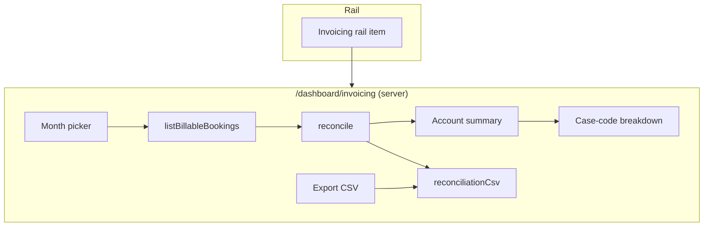

# Invoicing / Reporting — Shaping

## Source

> next thing i wanna do is remove the activity page its useless and with the amount of traffic we will be processing i..e 100 bookings a day its irrelvent. now that we have a basic payment system set up I wanna create an invoicing/reporting section I'm not sure what it will look like but im thinking a page that keeps track of payments and invoicing. What do you think - this client reconciles the charges at the end of the month using the case-code as the expense account. I wanna create a system that will help them with this instead of having to do it manually

---

## Problem

- The **Activity** page is dead weight — at ~100–200 bookings/day an audit feed isn't useful, and per-booking History already lives in the detail panel.
- Month-end **reconciliation is manual**: the client adds up charges and allocates each to an **expense account = the booking's case code**, by hand (off the JJ sheet). That's slow and error-prone, and gets worse with volume.

## Outcome

- Activity page gone; its rail slot reused for the new section.
- Operators can produce, in a few clicks, a **per-month, per-customer-account breakdown of charges grouped by case code**, accurate enough for the client's finance team to reconcile against expense accounts — replacing the manual spreadsheet step.

---

## What exists today (CURRENT)

| Piece | Reality |
|---|---|
| "Payment system" | **Pricing only** — `pricing.ts` suggests a contract price (transfer = route distance, hourly = hours) with placeholder rates; operator can override. **No money is captured.** |
| Per-booking charges | `contractPricePence` (agreed fare) + `carParkPence` + `waitingTimeMinutes` (driver fills on completion) + `serviceType` + `caseCode` + `accountCode` (customer account) + `seq` (BKNG-#####). |
| Money received | **Nothing** — no `paid`/`invoiced` status, no invoice records. |
| VAT / waiting £ / line total | **Not computed server-side** — the JJ sheet's Net/VAT/Total columns are left blank for the sheet's own formulas. |
| Reconciliation | Done manually by the client off the JJ sheet, allocating each charge to its case code. |

---

## Requirements (R)

| ID | Requirement | Status |
|----|-------------|--------|
| R0 | Replace the manual month-end step: produce a per-period breakdown of booking charges **grouped by case code** (the expense account) for a customer account, generated from booking data. | Core goal |
| R1 | Remove the Activity page + its rail nav entry. | Must-have |
| R2 | New **"Invoicing / Reporting"** section in the operator console (reuses the Activity rail slot). | Must-have |
| R3 | A charge line per **billable booking**: date, BKNG ref, passenger, customer account, case code, contract price, car park, waiting, line total. | Must-have |
| R4 | Aggregate by **case code** and **customer account** over a selectable **month**; show subtotals + grand total. | Must-have |
| R5 | Only **completed/approved** bookings are billable (exclude cancelled / in-flight); edits & cancellations must not double-count or leave stale figures. | Must-have |
| R6 | Export the breakdown in a format the client's finance can use (CSV at minimum). | Must-have |
| R7 | ~~Line total = contract price + car park, all-in. No separate waiting-time charge.~~ **SUPERSEDED by [ADR 0008](../adr/0008-driver-waiting-time-charge.md):** line total = contract + car park + **waiting charge**. Still no VAT line. | 🟡 Superseded |
| R8 | 🟡 v1 is **report-only**. Invoice/payment status tracking and customer-facing PDF invoices are **out of scope** (possible later). | 🟡 Out (v1) |

**Chunking note:** at 9 — fine for now.

---

## Decisions (Q1–Q5 resolved)

| # | Question | Decision |
|---|----------|----------|
| Q1 | Report-only vs stateful ledger? | 🟡 **Report-only → Shape A.** |
| Q2 | Internal report vs customer-facing PDF? | 🟡 **Internal reconciliation report** (in-app + CSV). PDF is future. |
| Q3 | VAT? | 🟡 **No VAT line** in v1. |
| Q4 | Waiting time → money? | ~~No waiting charge.~~ **SUPERSEDED by [ADR 0008](../adr/0008-driver-waiting-time-charge.md):** waiting beyond a free period is charged per-minute (30 min free, £0.50/min placeholder) and the driver gets a share. |
| Q5 | Grouping unit? | 🟡 **Customer account → case code → bookings**, per selectable month. |

**Selected shape: A — Reporting view.**

---

## Shapes (high-level — pick a direction)

### A: Reporting view (read model over bookings)
A new page that queries billable bookings for a chosen month, groups by customer account → case code, shows line items + subtotals + grand total, and exports CSV. **No new tables, no status tracking.** The page is a live derived view; re-running always reflects current booking data.

| Part | Mechanism | Flag |
|------|-----------|:----:|
| A1 | `listBillableBookings(month)` query — completed bookings in the London-month window, with charge fields. | |
| A2 | Aggregator: group by account → case code; compute line totals + subtotals (depends on R7). | ⚠️ |
| A3 | Reporting page: month picker, account filter, grouped table, totals. | |
| A4 | CSV export of the breakdown. | |
| A5 | Remove Activity route + rail item; add "Invoicing / Reporting" rail item. | |

### B: Invoices as records (durable, with status)
Everything in A, plus an **Invoice model**: "generate" snapshots a month's charges into Invoice + InvoiceLine rows per customer account, with a status (`draft → issued → paid`). The report becomes a list of invoices you can re-open, export, and mark paid. Durable history; figures frozen at issue time.

| Part | Mechanism | Flag |
|------|-----------|:----:|
| B1 | Invoice + InvoiceLine tables (account, period, case-code lines, totals, status, issuedAt, paidAt). | |
| B2 | `generateInvoices(month)` — snapshot billable bookings into invoices grouped by account (lines carry case code). | ⚠️ |
| B3 | Invoicing page: list invoices, open one, see case-code lines, mark issued/paid. | |
| B4 | Export an invoice (CSV; PDF if Q2 = customer-facing). | ⚠️ |
| B5 | Charge/VAT model (R7). | ⚠️ |
| B6 | Remove Activity; add rail item. | |

### C: Lean — reconciliation pivot on the existing JJ sheet
Lean on the sheet the client already uses for finance. Compute Net/VAT/Total server-side (fill the blank columns), and add a **case-code pivot** (monthly totals per case code per account) — either as a sheet tab or a small read-only page that mirrors it. Minimal new UI, leverages existing habit.

| Part | Mechanism | Flag |
|------|-----------|:----:|
| C1 | Server-side line total: fill Net/VAT/Total mirror columns (R7). | ⚠️ |
| C2 | Case-code monthly pivot (sheet tab or small page). | ⚠️ |
| C3 | Remove Activity; add rail item. | |

---

## Fit Check — R × A (selected)

| Req | Requirement | Status | A |
|-----|-------------|--------|---|
| R0 | Per-period charges grouped by case code per account | Core goal | ✅ |
| R1 | Remove Activity page + nav | Must-have | ✅ |
| R2 | New Invoicing/Reporting console section | Must-have | ✅ |
| R3 | Charge line per billable booking | Must-have | ✅ |
| R4 | Aggregate by case code + account / month | Must-have | ✅ |
| R5 | Only billable bookings; no stale double-count | Must-have | ✅ (live derived view — always current) |
| R6 | CSV export for finance | Must-have | ✅ |
| R7 | Line total = contract + car park + **waiting charge** (per [ADR 0008](../adr/0008-driver-waiting-time-charge.md); was "+ car park" only) | Superseded | ✅ |
| R8 | Report-only (status/PDF out of scope) | Out (v1) | ✅ (by design) |

**Nothing unsolved** — all requirements pass for Shape A. B/C retained above as audit trail.

---

## Detail A: concrete affordances (breadboard)

**Billable set:** bookings with `state = 'completed'` whose **pickup falls in the selected London month** (the trip's month — how the client reconciles). Cancelled / in-flight excluded. Live view — no snapshot, so edits/cancels are always reflected (R5).

**Line total:** `contractPricePence + (carParkPence ?? 0) + waitingFee(waitingTimeMinutes)` (R7, per [ADR 0008](../adr/0008-driver-waiting-time-charge.md)).

### UI affordances

| Affordance | Place | Description | Wires out |
|-----------|-------|-------------|-----------|
| U1 Rail item "Invoicing" | Rail | Replaces the removed "Activity" item; links to `/dashboard/invoicing`. | → `/dashboard/invoicing` |
| U2 Month picker | Invoicing page | Pick the London month (default = current). Updates `?month=`. | → N1 |
| U3 Account summary list | Invoicing page | One row per customer account in the month: account, trip count, total. | → U4 |
| U4 Case-code breakdown | Invoicing page | Per account, rows grouped by case code; each case code lists its bookings (date, BKNG ref, passenger, route, price, car park, line total) + case-code subtotal; account grand total. | — |
| U5 Export CSV button | Invoicing page | Downloads the month's breakdown as CSV (all accounts, one row per booking + the grouping keys). | → N3 |

### Non-UI affordances

| Affordance | Place | Description | Wires out |
|-----------|-------|-------------|-----------|
| N1 `listBillableBookings(db, month)` | server query | Completed bookings with pickup in the London-month window; selects charge fields (account, caseCode, seq, passenger, addresses, pickupAt, serviceType, contractPricePence, carParkPence). | → N2 |
| N2 `reconcile(bookings)` | pure domain | Groups → account → case code; computes line totals, case-code subtotals, account totals, grand total. Pure + unit-tested. | — |
| N3 `reconciliationCsv(report)` | pure domain | Flattens the report to CSV rows (account, case code, date, ref, passenger, route, contract £, car park £, total £). | — |
| N4 Remove Activity | cleanup | Delete `app/(dashboard)/dashboard/activity/`, drop the rail item, remove `listActivity` (keep `listBookingHistory`, still used by the detail panel). | — |

### Wiring

---

## Slices

| Slice | Demo | Contains |
|-------|------|----------|
| **V1 — Monthly reconciliation view** | Pick May → see LEGO Group → case codes → trips + subtotals + grand total. | N1, N2, U1–U4, N4 (remove Activity + add rail item) |
| **V2 — CSV export** | Click Export → download a CSV of the month's breakdown. | N3, U5 |

V1 delivers the core value (kills the manual step); V2 adds the hand-off format. Both are small.
