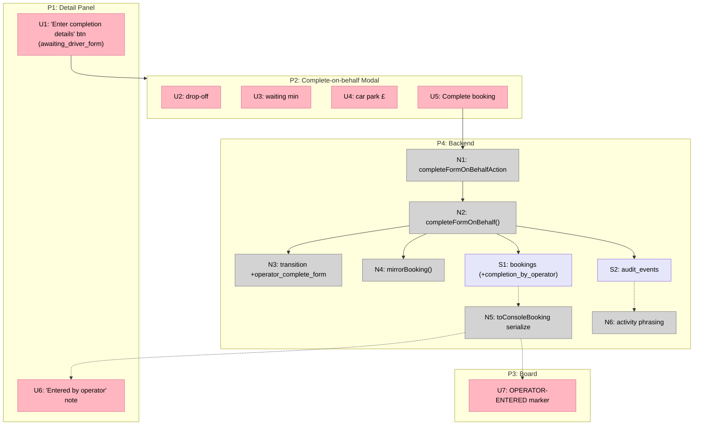

# Operator-completed form — Breadboard & Slice

> Shape: [`shaping.md`](./shaping.md) Shape A. Affordance tables are the source
> of truth; the Mermaid diagram renders them.

## Places

| # | Place | Status | Where |
|---|-------|--------|-------|
| P1 | Booking Detail Panel | existing — modified | `components/console/detail-panel.tsx` |
| P2 | Complete-on-behalf Modal | **NEW** | `components/console/complete-form-modal.tsx` |
| P3 | Console Board (card / list) | existing — modified | `components/console/console-board.tsx` |
| P4 | Backend (domain / service / db) | existing + new | `server/*` |

## UI Affordances

| # | Place | Component | Affordance | Control | Wires Out | Returns To |
|---|-------|-----------|------------|---------|-----------|------------|
| U1 | P1 | detail-panel (`awaiting_driver_form`) | **"Enter completion details"** button (beside "Generate completion link") | click | → P2 | — |
| U2 | P2 | complete-form-modal | drop-off time input | type | → N1 | — |
| U3 | P2 | complete-form-modal | waiting minutes input | type | → N1 | — |
| U4 | P2 | complete-form-modal | car park £ input | type | → N1 | — |
| U5 | P2 | complete-form-modal | "Complete booking" submit | click | → N1 | — |
| U6 | P1 | detail-panel (completion section, `completed`) | "Entered by \<operator\> on the driver's behalf" note when `completionByOperator` | render | — | ← N5 |
| U7 | P3 | board card / list row (`completed`) | subtle **OPERATOR-ENTERED** marker when `completionByOperator` | render | — | ← N5 |

## Code Affordances

| # | Place | Component | Affordance | Control | Wires Out | Returns To |
|---|-------|-----------|------------|---------|-----------|------------|
| N1 | P1/P2 | console-actions | `completeFormOnBehalfAction(bookingId, {dropoffAt, waitingTimeMinutes, carParkPence})` | call | → N2 | → U5 |
| N2 | P4 | services/completion | `completeFormOnBehalf()` — validate (reuse `completionFormSchema` minus token), `transition(awaiting_driver_form, operator_complete_form)`, atomic update → set completion fields + `completionSubmittedAt`, `approvedAt`, `approvedByOperatorId`, **`completionByOperator = true`**, `state = completed`; audit `operator_completed_form` (actor = operator); mirror | call | → N3, → S1, → N4, → S2 | → N1 |
| N3 | P4 | domain/booking-state | **NEW** event `operator_complete_form` (`awaiting_driver_form → completed`, no side effects) | call | — | → N2 |
| N4 | P4 | services/mirror | `mirrorBooking()` — completed row (Raise-invoice = Yes), unchanged | call | → (Sheet) | — |
| N5 | P3/P1 | page.tsx `toConsoleBooking` + `ConsoleBooking` | serialize `completionByOperator` to the client | call | — | → U6, U7 |
| N6 | P4 | services/activity | history phrasing for `operator_completed_form` ("completed the trip on the driver's behalf") | read | — | — |

## Data Stores

| # | Place | Store | Description |
|---|-------|-------|-------------|
| S1 | P4 | `bookings` (+ new col) | **`completion_by_operator`** bool (default false). Reuses existing `dropoffAt`, `waitingTimeMinutes`, `carParkPence`, `completionSubmittedAt`, `approvedAt`, `approvedByOperatorId`. |
| S2 | P4 | `audit_events` | New action `operator_completed_form` (actor = operator). |

## Breadboard

## Slice

One vertical slice — demo-able end to end through the simulator + console.

| # | Slice | Parts | Affordances | Demo |
|---|-------|-------|-------------|------|
| **V1** | **Operator completes the form on the driver's behalf** | A1–A5 | S1, S2, N3, N2, N1, U1, P2 (U2–U5), N4, N5, U6, U7, N6 | A booking sits in **Awaiting driver form**. Open it → **"Enter completion details"** → enter drop-off / waiting / car park → **Complete booking**. Booking jumps straight to **Completed** (no review stop); the detail + board show it was **entered by the operator on the driver's behalf**; invoicing picks it up like any completed job. |

**Lifecycle e2e:** extend `tests/e2e/lifecycle.spec.ts` with an operator-on-behalf arm — drive a booking to `awaiting_driver_form`, complete it from the panel modal, assert it lands in `completed` (skipping `awaiting_operator_review`) and shows the operator-entered marker.

**TDD coverage:**
- Unit (booking-state): `operator_complete_form` legal only from `awaiting_driver_form` → `completed`; illegal elsewhere.
- Integration (completion): `completeFormOnBehalf` happy (sets fields, `completionByOperator`, `approvedAt/By`, `completed`, audit `operator_completed_form`, mirrors) + unhappy (not found, wrong state, validation: negative/oob values). Plus: a stale driver link submit after operator completion is refused (`wrong_state`) — proves R6.
