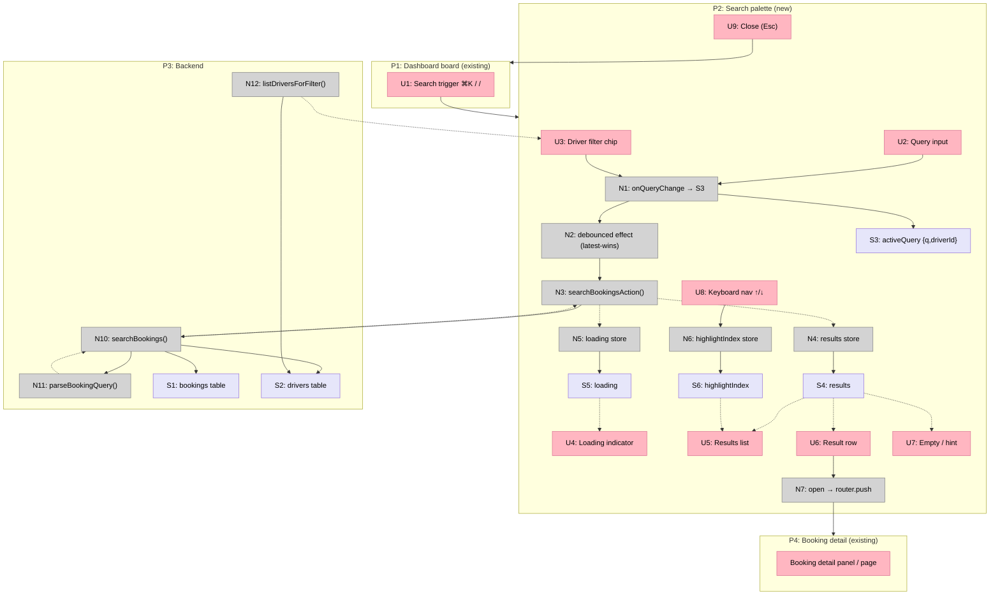

# Operator Search Rework — Breadboard & Slices

Details **Shape A (command palette)** from [shaping.md](./shaping.md) into affordances, then slices them for implementation. Engine resolved in [spike-search-engine.md](./spike-search-engine.md).

---

## Detail A: Places

| # | Place | Description |
|---|-------|-------------|
| P1 | Dashboard board (existing) | Where the operator is; palette is summoned from here and the board stays visible behind it (R9) |
| P2 | Search palette (new) | `⌘K` / `/` overlay — dimmed backdrop, board visible behind, not interactive while open |
| P3 | Backend (existing services/db) | `searchBookings` query + bookings/drivers tables |
| P4 | Booking detail (existing) | The console detail panel / `/dashboard/bookings/[id]` a result opens |

**Decision:** the palette becomes THE search. The current topbar `?q=` client-side box is **converted into the palette trigger** (U1) — we don't keep two competing search mechanisms. The board's day / assignee / state / show-done view filters are untouched.

## Detail A: UI Affordances

| # | Place | Component | Affordance | Control | Wires Out | Returns To |
|---|-------|-----------|------------|---------|-----------|------------|
| U1 | P1 | topbar | Search trigger (`⌘K` / `/` / click) | click/key | → P2 | — |
| U2 | P2 | search-palette | Query input | type | → N1 | — |
| U3 | P2 | search-palette | Driver filter chip | click | → N1 | ← N12 |
| U4 | P2 | search-palette | Loading indicator | render | — | ← N5 |
| U5 | P2 | search-palette | Results list | render | → U6 | ← N4 |
| U6 | P2 | search-result-row | Result row (`BKNG-… · date · exec · driver · state`) | click / ↵ | → N7 | ← N4 |
| U7 | P2 | search-palette | Empty / hint state | render | — | ← N4 |
| U8 | P2 | search-palette | Keyboard nav (↑/↓ highlight) | keydown | → N6 | ← N6 |
| U9 | P2 | search-palette | Close (Esc / backdrop) | click/key | → P1 | — |

## Detail A: Code Affordances

| # | Place | Component | Affordance | Control | Wires Out | Returns To |
|---|-------|-----------|------------|---------|-----------|------------|
| N1 | P2 | search-palette | `onQueryChange` → write `activeQuery` (S3) | call | → S3, → N2 | — |
| N2 | P2 | search-palette | Debounced effect (~200ms) on S3; latest-wins guard | observe | → N3 | — |
| N3 | P2 | search-palette | `searchBookingsAction(q, driverId)` (server action) | call | → N10 | → N4, → N5 |
| N4 | P2 | search-palette | `results` store (write) | write | — | → U5, U6, U7 |
| N5 | P2 | search-palette | `loading` store (write) | write | — | → U4 |
| N6 | P2 | search-palette | `highlightIndex` store (write) | write | — | → U5, U8 |
| N7 | P2 | search-palette | Open result → `router.push(/dashboard/bookings/[id])` | call | → P4 | — |
| N10 | P3 | bookings-query | `searchBookings(db, q, { driverId, limit })` — normalise→seq exact OR `ilike` group over passenger/driver/address/account/case; `leftJoin(drivers)`; `LIMIT`; → `ConsoleBooking[]` | call | → S1, → S2 | → N3 |
| N11 | P3 | booking-ref | `parseBookingQuery(q)` — strip `BKNG-`/`#`/zeros → int | call | — | → N10 |
| N12 | P3 | drivers-query | `listDriversForFilter()` (active drivers) | call | → S2 | → U3 |

## Detail A: Data Stores

| # | Place | Store | Description |
|---|-------|-------|-------------|
| S1 | P3 | `bookings` table | Read (search + seq match) |
| S2 | P3 | `drivers` table | Read (name match join + filter list) |
| S3 | P2 | `activeQuery` | `{ q, driverId }` current palette state |
| S4 | P2 | `results` | `ConsoleBooking[]` from last search |
| S5 | P2 | `loading` | Boolean while a query is in flight |
| S6 | P2 | `highlightIndex` | Keyboard-selected row index |

## Wiring

---

## Slices

| # | Slice | Mechanism | Affordances | Demo |
|---|-------|-----------|-------------|------|
| **V1** | **Engine + palette returns results** | S1 (engine) + S3-A (transport) + A2 | U1, U2, U4, U5, U7, N1, N2, N3, N4, N5, N10, N11, S1, S2, S3, S4, S5 | Press `⌘K`/`/` from any day; type `marcus`, `42`, or `BKNG-00042` → matching bookings from **any date** appear live as you type |
| **V2** | **Open & keyboard-drive** | A4 (R8) + nav | U6, U8, U9, N6, N7, S6, P4 | `↑/↓` to highlight, `↵` opens the booking detail; `Esc` closes back to the board |
| **V3** | **Driver filter** | A3 (R6) | U3, N12 | Set "Driver: Marcus" chip → results scope to that driver's jobs |

V1 is the minimal demo-able increment (search works end-to-end). V2/V3 layer interaction polish and the driver filter. Each ends in visible UI. Wires from V1 affordances to U6/N7 (V2) are stubs until V2 is built.

### V1 — Engine + palette returns results

| # | Component | Affordance | Control | Wires Out | Returns To |
|---|-----------|------------|---------|-----------|------------|
| U1 | topbar | Search trigger (`⌘K`/`/`) | key/click | → P2 | — |
| U2 | search-palette | Query input | type | → N1 | — |
| U4 | search-palette | Loading indicator | render | — | ← N5 |
| U5 | search-palette | Results list | render | → U6 (stub) | ← N4 |
| U7 | search-palette | Empty / hint state | render | — | ← N4 |
| N1 | search-palette | `onQueryChange` → S3 | call | → S3, → N2 | — |
| N2 | search-palette | Debounced effect, latest-wins | observe | → N3 | — |
| N3 | search-palette | `searchBookingsAction(q)` | call | → N10 | → N4, → N5 |
| N4 | search-palette | `results` store | write | — | → U5, U7 |
| N5 | search-palette | `loading` store | write | — | → U4 |
| N10 | bookings-query | `searchBookings(db, q, {limit})` | call | → S1, → S2 | → N3 |
| N11 | booking-ref | `parseBookingQuery(q)` → seq int | call | — | → N10 |

**Demo:** From today's board, `⌘K` → type `42` → BKNG-00042 appears (any date); type `marcus` → all Marcus's jobs; type a pickup address → matches. Updates ~200ms after you stop typing.

**Tests (TDD):** `parseBookingQuery` unit (`42`/`00042`/`BKNG-00042`/`bkng-42` → 42; non-numeric → null); `searchBookings` integration on PGlite (seq exact, driver-name join match, passenger/address/account/case ILIKE, limit bound, no-match empty); action wiring.

### V2 — Open & keyboard-drive

| # | Component | Affordance | Control | Wires Out | Returns To |
|---|-----------|------------|---------|-----------|------------|
| U6 | search-result-row | Result row | click / ↵ | → N7 | ← N4 |
| U8 | search-palette | Keyboard nav ↑/↓ | keydown | → N6 | ← N6 |
| U9 | search-palette | Close (Esc / backdrop) | key/click | → P1 | — |
| N6 | search-palette | `highlightIndex` store | write | — | → U5, U8 |
| N7 | search-palette | Open → `router.push(/dashboard/bookings/[id])` | call | → P4 | — |

**Demo:** arrow to a row, Enter opens the booking; Esc returns to the board where you left it (R9).

### V3 — Driver filter

| # | Component | Affordance | Control | Wires Out | Returns To |
|---|-----------|------------|---------|-----------|------------|
| U3 | search-palette | Driver filter chip | click | → N1 | ← N12 |
| N12 | drivers-query | `listDriversForFilter()` | call | → S2 | → U3 |

**Demo:** pick "Driver: Marcus" → results scope to Marcus's jobs; combine with a typed term.

**Tests (TDD):** `searchBookings` integration with `driverId` set (scopes correctly; combines with term).
